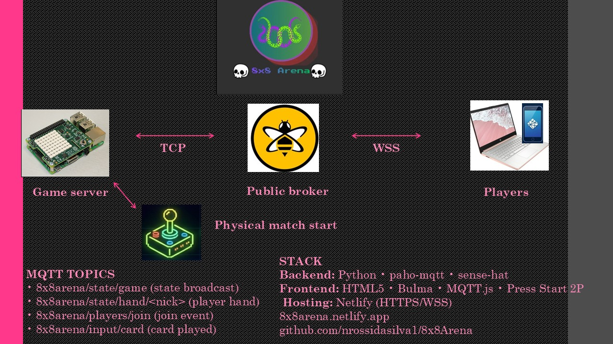

# 8x8Arena 🎮

**A crowd-controlled Snake battle. IoT + web + retro arcade, all in one tiny 8x8 grid.**



**Play it live:** https://8x8arena.netlify.app  


---
## What is this

This is my final project for the Computer Systems and Networks
assignment, part of the HDip in Computer Science at SETU.

I'm passionate about games, and that's why I decided to study
computer science — to learn every skill I can to one day work on
making games myself. I know this is just the beginning of the
path, with hours and hours of self-study and a lot more technology
to learn ahead. But for this assignment, I got to test how hard
and complex things actually are when the digital and the real
world have to talk to each other in real time — and when it works,
honestly, it's amazing.

I'm happy with the final product. It cost me a lot of time, hours
of sleep, a bit of my health, and a lot of stress, but the concept
is something I really wanted to build: a PvP game (players vs
players), split into two teams, with crowd control. Everyone gets
to decide the direction the snake goes — using random pick from
the team's queue, which keeps the chaos alive. The team size has
no hard limit, but in my tests too many simultaneous players
introduced a bit of delay and freezing, so the system has a
practical ceiling.

I went with cards as a deck mechanic because card-based games are
having a moment right now — Balatro, Hearthstone, that kind of
energy — and it fit the design better than just buttons. The
inspiration was "Twitch Plays Pokemon," where the chat decides the
moves and chaos unfolds. Except instead of a screen, here it's a
real LED matrix on a Raspberry Pi sitting on someone's desk.

The Pi is the host. The browsers are the players. The host opens
the table, the players join. Real-time IoT with a physical
handshake.
---
## How it works

Two teams (Green and Purple) fight on an 8x8 LED grid attached to a Raspberry Pi. Players join from their phones, get a hand of four cards, and tap to move. Every 0.7 seconds the system picks ONE card from each team's queue at random — many players, one snake, organized chaos.

If you've heard of "Twitch Plays Pokemon," same vibe. Except instead of Pokemon, it's Snake. And instead of a screen, it's a real LED matrix on a Raspberry Pi sitting on someone's desk.

The Pi is the host. The browsers are the players. The host opens the table, the players join. Real-time IoT with a physical handshake.
---
## How to play

1. Open https://8x8arena.netlify.app on your phone or computer.
2. Type a nickname, pick Green or Purple.
3. Wait for someone with the Pi to press the joystick to start the match.
4. Tap cards from your hand: directions (UP/DOWN/LEFT/RIGHT), TURBO (zoom for 5s), or BITE (chomp 2 pixels off the other team's snake).
5. First team to 10 points OR to eliminate the opponent wins.

The rules in full are in [docs/RULES.md](docs/RULES.md).

---

## The Stack

**Game server (the Pi)** — Python 3 with `paho-mqtt` and `sense-hat`. Runs the game loop at 0.7s per tick, owns the state, drives the 8x8 LED matrix.

**Frontend** — HTML5 with Bulma for layout, vanilla JavaScript, MQTT.js for the broker connection, Press Start 2P for the retro vibe. Hosted on Netlify with auto-deploy from this repo.

**Communication** — MQTT, using HiveMQ's free public broker. The Pi connects via TCP, the browsers via WebSocket Secure. Topics, payloads, and schemas are in [docs/PROTOCOL.md](docs/PROTOCOL.md).

**Hardware** — Raspberry Pi 4 + SenseHAT (the 8x8 LED matrix with joystick).

---
## Documentation

- [Project Proposal](PROPOSAL.pdf)
- [Game Rules](docs/RULES.md) — for players
- [MQTT Protocol](docs/PROTOCOL.md) — for developers
---

## Running it yourself

You need a Raspberry Pi with a SenseHAT (or the sense-emu emulator if you don't have the hardware).

```bash
git clone https://github.com/nrossidasilva1/8x8Arena.git
cd 8x8Arena
python3 -m venv .venv
source .venv/bin/activate
pip install paho-mqtt sense-hat
python3 code/game_main.py
```

Then either open https://8x8arena.netlify.app on your phone, or
serve `frontend/` locally with VS Code Live Server. Press the
SenseHAT joystick middle button to start a match.

---

## The journey

The v1.0 paper plan had snake-vs-snake collision, a Pi Camera
streaming the LED matrix to remote players, a predator-mode Power
Pill chasing the opponent's tail. Most of it didn't survive contact
with reality.

I started small. The `tests/` folder was my laboratory — taste a
piece, learn how it works, then put it in the real code. SenseHAT
display (x columns, y rows, turning lights on). Snake movement.
Food spawning. The deck. Step by step, code-test-fix-add. Like the
snake itself, the game grew one piece at a time.

The hard part wasn't writing code, it was **giving up on plans**:

- **The camera went first.** The Pi Camera sees halos when
  pointed at an LED matrix up close, and encoding video stole CPU
  from the game loop. The browser now renders its own 8x8 grid,
  fed by the same MQTT stream as the LEDs. Same data, no camera.

- **Then collision went.** Two snakes wrapping, growing, and
  overlapping became a tangle of edge cases. I replaced the
  predator-mode Power Pill with BITE: instant, deterministic, -2
  pixels off the opponent's tail. Same effect, sane code.

- **Tick rate dropped from 1s to 0.7s.** A full second per move
  felt like dial-up.

- **The snake stopped stopping.** Empty queue used to freeze it.
  Now it coasts, Nokia-style.

None of these were planned cuts. That's the lesson I'm taking from
this assignment — finished beats perfect.

## What v1.1 has

- Two-team battle on an 8x8 LED matrix (Raspberry Pi SenseHAT)
- Live mirror in the browser, anywhere in the world, via MQTT
- Lobby with nickname + team selection
- Per-player card hands of 4, drawn from a weighted deck
- Direction cards + TURBO (fast mode) + BITE (instant -2 on opponent)
- Two win conditions: 10 points OR opponent eliminated
- Victory message on the SenseHAT in the winning team's color
- Animated victory banner in the browser
- Match history saved to `leaderboard.csv` with timestamps and player nicknames

---

## What v1.1 doesn't have (the v2 list)

- Real snake-vs-snake and self-collision
- Match-start gating (right now any number of players, even zero, can start the game from the joystick)
- A leaderboard display page in the browser (only the CSV exists)
- Chat, sound effects, music
- CPU opponent for solo play
- A way to start the match remotely (intentional in v1 — the physical joystick is part of the concept)

---
## Author

**Nicolas Rossi da Silva** — Student ID: W20119127  
HDip Computer Science, 2026
---
## License

MIT License — see [LICENSE](LICENSE) file.